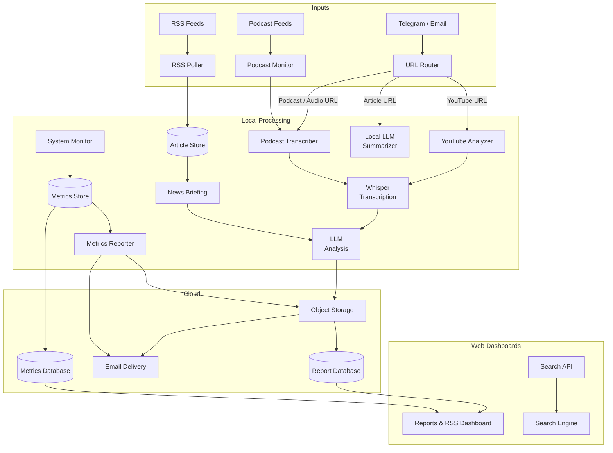

# Sector 7G Automated Intelligence System

> *"I am so smart. S-M-R-T." — Homer J. Simpson*

A fully automated, 24/7 intelligence pipeline running on a home Linux server. Ingests RSS feeds, transcribes podcasts, analyzes YouTube videos, monitors email, and delivers formatted AI briefings via email and two custom web dashboards — all without touching a button.

---

## System Architecture



---

## Infrastructure

| Component | Details |
|---|---|
| **Host** | Fedora Linux 43, kernel 6.19 |
| **Shell** | bash — all scripts run directly, no containers |
| **Python** | 3.14.3 — virtualenv at `.venv/` |
| **Whisper** | CPU-only (`--device cpu`) — GPU is reserved for Ollama |
| **Ollama** | Local inference server — `gemma4:e2b` primary model |
| **Cloud** | AWS (S3, DynamoDB, SES, Lambda, API Gateway) |

---

## AI Operations — The Flanders Crew

The system is operated by **Claude Code** running as a persistent AI agent. For complex tasks, it spawns a team of specialized sub-agents — each with a defined role and a Simpsons character persona.

```
You (Telegram)
     │
     ▼
┌──────────────────────────────────────────────────┐
│  Homer (Claude Code — main agent)                │
│  Reads Telegram via MCP, routes work,            │
│  deploys code, manages repos                     │
└──────────────────────────────────────────────────┘
     │
     ▼
┌──────────────────────────────────────────────────┐
│  Rev. Lovejoy — Overseer                         │
│  High-stakes decisions, architectural review,    │
│  final approval before major changes             │
└──────────────────────────────────────────────────┘
     │
     ├──► Ned Flanders — Project Manager
     │    Plans tasks, coordinates the team,
     │    writes and maintains documentation
     │
     ├──► Maude Flanders — QA Tester
     │    Tests code, finds bugs, validates outputs,
     │    hunts edge cases — nothing ships broken
     │
     ├──► Rod Flanders — Developer
     │    Writes and edits code, fixes bugs,
     │    implements features exactly as specced
     │
     ├──► Prof. Frink — Analyst
     │    Analyzes proposed solutions and approaches,
     │    evaluates trade-offs before the team commits
     │
     ├──► Todd Flanders — Researcher
     │    Web searches, reads docs, investigates
     │    errors, compares options and tools
     │
     ├──► Kirk Van Houten — Text Tasks
     │    Low-stakes text tasks — summaries, rewrites,
     │    formatting (runs directly, no local model needed)
     │
     └──► Groundskeeper Willy — Security
          Reviews all content before any public push,
          hunts for secrets, internal URLs, and private info
```

### How sub-agents work

Sub-agents run in **parallel** when tasks are independent (e.g. Todd researching while Rod implements), and **sequentially** when one result feeds the next (e.g. Todd researches → Rod builds → Maude tests). Rev. Lovejoy is consulted for decisions that affect the whole system. Prof. Frink is consulted when an approach needs analysis before the team commits. Kirk handles low-stakes text tasks (summaries, rewrites, formatting) directly. Groundskeeper Willy reviews all content before any public push — checking for emails, API keys, internal URLs, and private resource names.

For multi-step tasks initiated via Telegram, Homer routes work through Ned, who sends live progress updates back to Telegram at each milestone.

### MCP Integration

Claude connects to Telegram via the `plugin:telegram` MCP server. All replies, file attachments, and reactions go through the `reply` tool — Claude's text output is never shown directly in Telegram chat.

---

## LLM Stack

| Pipeline | Provider | Model |
|---|---|---|
| News Briefing (`generate_report.py`) | Ollama (local) | `qwen3.5:9b` |
| YouTube / Podcast / Email (default) | Ollama (local) | `gemma4:e2b` |
| Override (any pipeline) | OpenRouter | configurable via `LLM_PROVIDER` / `LLM_MODEL` env vars |
| Agent text tasks (Kirk Van Houten) | Claude (sub-agent) | direct — no local model needed |
| Dashboard TTS | Mistral API | `voxtral-mini-tts-2603` |

**Ollama models available locally:**
- `gemma4:e2b` — primary model for YouTube, podcast, and email pipelines
- `qwen3.5:9b` — news briefing model (large context window handles full article list)
- `ministral-3:3b` — available

---

## Cron Schedule

| Schedule | Pipeline | Description |
|---|---|---|
| Every minute | System Monitor | CPU / mem / disk / GPU → SQLite + DynamoDB |
| Every 5 min | Email & URL Router | Polls inbox, routes URLs, summarizes articles |
| Every 10 min | RSS Poller | Fetches new articles → SQLite + DynamoDB |
| Every hour | News Briefing | Ollama analysis → S3 → DynamoDB → SES email |
| Every hour | Metrics Reporter | matplotlib charts → S3 → SES email |
| Daily 4am | Podcast Monitor | Polls podcast feeds, routes new episodes |
| Daily 8am UTC | KBBL Alerts | Checks keyword alerts (Google News + Brave), emails digest if new results |

---

## Pipeline Detail

### News Briefing
Runs hourly. Pulls unread articles from the article store, sends them to the local Ollama model (`qwen3.5:9b`), gets a structured trend analysis back, renders it as styled HTML, emails it via SES, stores the markdown in S3 + DynamoDB, and prunes local copies to the latest 5. Pruned files and the new briefing are committed and pushed to git automatically.

### YouTube Analyzer
Triggered by a YouTube URL dropped in Telegram or email. Full pipeline:

1. `yt-dlp` extracts the video title
2. `yt-dlp` downloads auto-generated `.vtt` subtitles (English)
3. If no subtitles exist, falls back to full Whisper transcription (CPU)
4. Subtitle text is cleaned and sent to the local LLM for structured analysis
5. Output format: `# Title`, `## Summary & Key Takeaways`, `## Detailed Notes` with section headings
6. Markdown committed to `_media/youtube/`, uploaded to S3, indexed in DynamoDB
7. Styled HTML emailed via SES

Pass `--music-video` to skip LLM analysis and route the download to the music catalog instead.

### Podcast Transcriber
Triggered by an Apple Podcasts URL, direct audio URL, or the daily feed monitor. Full pipeline:

1. `yt-dlp` downloads the audio file to a staging directory
2. Whisper (`--device cpu`) transcribes — ~4–5 min for a 40-min episode
3. Transcript sent to the local LLM for structured analysis
4. Output format: `# Show — Episode Title`, `## Summary & Key Takeaways`, then numbered topic sections
5. Markdown committed to `_media/podcasts/`, uploaded to S3, indexed in DynamoDB
6. Styled HTML emailed via SES

Note: Whisper cold-start adds ~2 min. GPU runs CPU-only — occupied by Ollama.

### Email & URL Router
Runs every 5 min. Polls a Gmail inbox via IMAP. Routes URLs to the correct pipeline (YouTube → YouTube Analyzer, podcast → Podcast Transcriber, articles → inline Ollama summary). Extracts calendar events and sends Telegram notifications.

### Podcast Feed Monitor
Runs daily at 4am. Polls podcast RSS feeds. On new episodes, routes to the Podcast Transcriber. Tracks processed episodes in a local SQLite DB.

### System Metrics
Collects CPU, memory, disk, network, and GPU stats every minute into SQLite and DynamoDB (7-day TTL). Hourly, generates matplotlib charts, uploads to S3, and emails an HTML metrics report.

---

## URL Routing

Anything dropped in Telegram or emailed to the bot is auto-routed:

| URL Pattern | Handler |
|---|---|
| `youtube.com` / `youtu.be` | YouTube Analyzer |
| `youtube.com` / `youtu.be` + `--music-video` | Music catalog (no LLM analysis) |
| `podcasts.apple.com` | Podcast Transcriber |
| Direct audio URL (`.mp3`, `.m4a`, etc.) | Podcast Transcriber |
| Any other article URL | Local LLM inline summary |

---

## Podcast Subscriptions

Managed in `_config/podcast_subscriptions.json`.

- The AI Daily Brief
- The Sideload (9to5Google)
- Leaders with Francine Lacqua
- Bloomberg Businessweek
- Bloomberg Tech
- Pod Save America
- The Daily (NYT)

---

## Web Dashboards

### Sector7G

Reports and RSS reader dashboard. Deployed as AWS Lambda + API Gateway.

```
┌─────────────────────────────────────────────────────────────────┐
│  ⚡ SECTOR 7G    [Overview] [Reports] [RSS] [KBBL]   ⚙  🔔     │
├─────────────────────────────────────────────────────────────────┤
│  OVERVIEW                                                        │
│  ┌──────────┐  ┌──────────┐  ┌──────────┐  ┌──────────┐        │
│  │  CPU 12% │  │ MEM 48% │  │ DISK 61% │  │  GPU 0%  │        │
│  └──────────┘  └──────────┘  └──────────┘  └──────────┘        │
│  ┌─────────────────────────┐  ┌─────────────────────────┐       │
│  │   CPU History (24h)     │  │   Memory History (24h)  │       │
│  │  ▁▂▃▂▁▁▂▃▄▃▂▁▁▂▃▄▅▄▃▂ │  │  ▅▅▅▆▆▆▅▅▅▅▅▅▆▆▆▆▆▅▅▅  │       │
│  └─────────────────────────┘  └─────────────────────────┘       │
├─────────────────────────────────────────────────────────────────┤
│  REPORTS                                                         │
│  [News Briefings] [YouTube] [Podcasts]                          │
│  ┌──────────────────┐  ┌────────────────────────────────────┐   │
│  │ Mar 31 07:00     │  │ # Daily News Briefing — Mar 31     │   │
│  │ Mar 31 06:00     │  │                                    │   │
│  │ Mar 31 05:00  ●  │  │ ## Analysis & Trends to Watch      │   │
│  │ Mar 31 04:00     │  │ ...                                │   │
│  │ Mar 31 03:00     │  │                        [🔊 Listen] │   │
│  └──────────────────┘  └────────────────────────────────────┘   │
├─────────────────────────────────────────────────────────────────┤
│  RSS                                                             │
│  ┌─ Feeds ─ + Add ‹ ─┐  ┌─ Articles ────┐  ┌─ Content ──────┐ │
│  │ AWS News Blog  64 │  │ Article 1     │  │ Title          │ │
│  │ Hacker News   459 │  │ Article 2     │  │ Published...   │ │
│  │ BBC News      279 │  │ Article 3     │  │                │ │
│  │ Bloomberg Mkt 747 │  │ Article 4     │  │ Summary text   │ │
│  │ NPR Tech       17 │  │ Article 5     │  │                │ │
│  └───────────────────┘  └───────────────┘  └────────────────┘ │
└─────────────────────────────────────────────────────────────────┘
```

**Features:**
- System metrics overview with live charts (CPU, memory, disk, GPU)
- Report browser for news briefings, YouTube analyses, and podcast notes
- TTS playback via Mistral Voxtral — reads "Summary & Key Takeaways" section only
- RSS reader with collapsible feed panel, article view, Kagi summarizer integration
- KBBL — Google Alerts clone: monitors keywords via Google News RSS and Brave News API, horizontal chip tab UI (mobile-optimized), daily email digest via SES when new results arrive
- Settings dropdown with dark mode (auto-follows system preference, manual override supported)
- All data served from DynamoDB + S3

### Sector7B

Privacy-focused search engine. Deployed as AWS Lambda + API Gateway.

```
┌─────────────────────────────────────────────────────────────────┐
│                         ⚡ SECTOR 7B                            │
│                                                                  │
│              ┌──────────────────────────────────┐               │
│              │  🔍  Search anything...           │               │
│              └──────────────────────────────────┘               │
│                                                                  │
│  ┌───────────────────────────────────────────────────────────┐  │
│  │ Quick Answer                                              │  │
│  │ ─────────────────────────────────────────────────────    │  │
│  │  • Key point one about the query topic                   │  │
│  │  • Key point two with supporting detail                  │  │
│  │  • Key point three                            ▼ More     │  │
│  └───────────────────────────────────────────────────────────┘  │
│                                                                  │
│  ┌───────────────────────────────────────────────────────────┐  │
│  │  Result Title                                [Kagi]       │  │
│  │  result.domain.com                                        │  │
│  │  Snippet of the result text showing context...            │  │
│  └───────────────────────────────────────────────────────────┘  │
└─────────────────────────────────────────────────────────────────┘
```

**Features:**
- Powered by Brave Search API
- Quick Answer box: AI-generated summary (first 60 words shown, expand to full)
- Kagi Summarizer button on each result (bullet points / digest format)
- Dark mode support

---

## Setup

### Prerequisites

- Fedora Linux (or equivalent) — `python3`, `git`, `ffmpeg`, `yt-dlp` installed via package manager
- Ollama running locally with `gemma4:e2b` pulled: `ollama pull gemma4:e2b`
- AWS account with SES, S3, and DynamoDB configured
- A Gmail account with an app password for IMAP access

### Install Python dependencies

```bash
python3 -m venv .venv
source .venv/bin/activate
pip install -r requirements.txt
```

### Configure environment

Copy `.env.example` to `.env` and fill in your values:

```bash
# Email
EMAIL_ADDRESS=<your-gmail-address>
EMAIL_APP_PASSWORD=<your-app-password>
MY_EMAIL=<your-personal-email>

# Telegram
TELEGRAM_BOT_TOKEN=<your-telegram-bot-token>
TELEGRAM_CHAT_ID=<your-telegram-chat-id>

# AWS
AWS_DEFAULT_REGION=us-east-1
S3_BUCKET=<your-s3-bucket-name>
DYNAMODB_REPORTS_TABLE=<your-reports-table-name>
DYNAMODB_METRICS_TABLE=<your-metrics-table-name>

# LLM override (optional — default is local Ollama)
OPENROUTER=<your-openrouter-api-key>
```

### AWS resources needed

| Service | Purpose |
|---|---|
| S3 bucket | Reports, transcripts, media storage |
| S3 bucket (optional) | Music video catalog |
| DynamoDB table | Report index (PK: `category`, SK: `timestamp#filename`) |
| DynamoDB table | System metrics (PK: `machine`, SK: `timestamp`, TTL: 7 days) |
| SES | Outbound email delivery (verify your sending domain) |
| Lambda + API Gateway | Web dashboards (optional) |

### Run manually

```bash
# News briefing
python3 _scripts/generate_report.py

# Process a YouTube video
./_scripts/process_youtube.sh "https://youtube.com/watch?v=..."

# Process a YouTube video as music (no LLM, routed to music catalog)
./_scripts/process_youtube.sh --music-video "https://youtube.com/watch?v=..."

# Process a podcast episode
./_scripts/process_podcast.sh "https://podcasts.apple.com/..."

# Check email
python3 _scripts/check_email.py
```

### LLM override at runtime

```bash
LLM_PROVIDER=openrouter LLM_MODEL=deepseek/deepseek-v3.2 ./_scripts/process_youtube.sh "<URL>"
```

### Cron setup

```
*/5 * * * *   /path/to/_scripts/check_email.py
0 4 * * *     /path/to/_scripts/check_podcasts.py
* * * * *     /path/to/_scripts/collect_metrics.py
0 * * * *     /path/to/_scripts/email_metrics_report.py
*/10 * * * *  /path/to/_scripts/poll_feeds.py
0 * * * *     /path/to/_scripts/generate_report.py
0 8 * * *     /path/to/<your-dashboard-repo>/_scripts/alerts_cron.py   # KBBL alerts
```

---

## Output Directories

| Directory | Contents | Retention |
|---|---|---|
| `_reports/` | Hourly news briefing markdowns + logs | Latest 5 briefings kept |
| `_media/podcasts/` | Podcast transcription + analysis | Latest 5 kept |
| `_media/youtube/` | YouTube analysis notes | Latest 5 kept |
| `_tmp/` | Staging area for downloads (gitignored) | Cleared after each run |
| `_config/` | RSS feeds, podcast subscriptions, episode DB | Committed |

---

## Troubleshooting

### No news briefing emails arriving
1. Check cron log for errors
2. Verify Ollama is running: `ollama list`
3. Test Ollama model is available: `ollama run gemma4:e2b "hello"`
4. Check SES send quota: `aws sesv2 get-account`
5. Confirm DB has unread articles: `sqlite3 _reports/rss_articles.db "SELECT count(*) FROM articles WHERE reported_at IS NULL"`

### Podcast/YouTube processing failing
1. Run the script manually to see full output
2. Test yt-dlp: `yt-dlp --print "%(title)s" "<URL>"`
3. Verify Ollama is running and `gemma4:e2b` is loaded: `ollama list`
4. Check `_tmp/` for leftover files from a failed run — clean them manually

### Email monitor not routing URLs
1. Check the email log
2. Confirm IMAP credentials in `.env` are valid (Gmail app password, not account password)
3. Run `python3 _scripts/check_email.py` manually

### Metrics not appearing
1. Confirm psutil is installed: `python3 -c "import psutil"`
2. Check SQLite: `sqlite3 _reports/metrics.db "SELECT ts FROM metrics ORDER BY ts DESC LIMIT 5"`

### Git push failing inside scripts
1. Confirm SSH key is loaded: `ssh -T git@github.com`
2. Check git remote: `git remote -v`

### Ollama model slow or timing out
- `gemma4:e2b` cold-start can take ~2 min; Ollama timeout is set to 300s
- GPU is occupied by Ollama — Whisper must run with `--device cpu`
- If Ollama is unresponsive: `systemctl restart ollama`

---

## Recent Reports

Each item links to the styled HTML version. Raw markdown is also available alongside each file.

### News Briefings
- [Daily News Briefing — April 25, 2026 10:46](_reports/Daily_News_Briefing_April_25_2026_1046.html)
- [Daily News Briefing — April 25, 2026 10:45](_reports/Daily_News_Briefing_April_25_2026_1045.html)
- [Daily News Briefing — April 25, 2026 10:00](_reports/Daily_News_Briefing_April_25_2026_1000.html)
- [Daily News Briefing — April 25, 2026 09:00](_reports/Daily_News_Briefing_April_25_2026_0900.html)
- [Daily News Briefing — April 25, 2026 08:00](_reports/Daily_News_Briefing_April_25_2026_0800.html)

### YouTube Analyses
- [TheQuartering: YouTube's Worst Content Creator](_media/youtube/TheQuartering_YouTube_s_Worst_Content_Creator.html)
- [The Most Dangerous AI Got Hacked](_media/youtube/The_Most_Dangerous_AI_Got_Hacked.html)
- [Why does bias exist in AI models?](_media/youtube/Why_does_bias_exist_in_AI_models.html)
- [Open source is dead now](_media/youtube/Open_source_is_dead_now.html)
- [Should you let OpenClaw pen test your system? Plus Cybersecurity for ephemeral software](_media/youtube/Should_you_let_OpenClaw_pen_test_your_system_Plus_Cybersecurity_for_ephemeral_software.html)

### Podcast Notes
- [Trump's View of the War](_media/podcasts/Trump_s_View_of_the_War.html)
- [Trump Loses the Gerrymander War](_media/podcasts/Trump_Loses_the_Gerrymander_War.html)
- [Intel Delivers Strong AI-Fueled Outlook](_media/podcasts/Intel_Delivers_Strong_AI_Fueled_Outlook.html)
- [Women Lose Significant Bone Density During Menopause](_media/podcasts/Women_Lose_Significant_Bone_Density_During_Menopause.html)
- [DOJ Drops Powell Probe, Smoothing Path for Warsh to Lead Fed](_media/podcasts/DOJ_Drops_Powell_Probe_Smoothing_Path_for_Warsh_to_Lead_Fed.html)

---

> *"Every time I learn something new, it pushes some old stuff out of my brain." — Homer J. Simpson*
