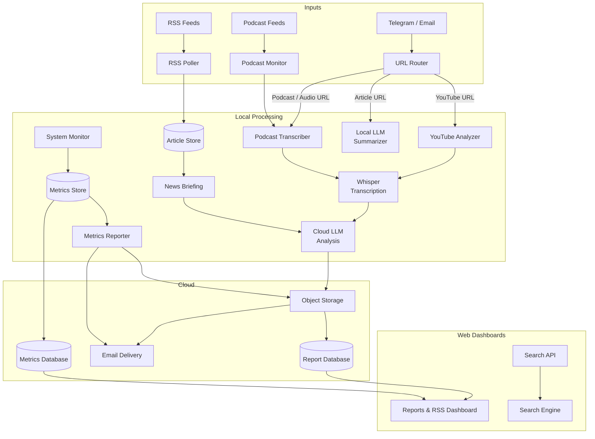

# Sector 7G Automated Intelligence System

> *"I am so smart. S-M-R-T." — Homer J. Simpson*

A fully automated, 24/7 intelligence pipeline running on a home Linux server. Ingests RSS feeds, transcribes podcasts, analyzes YouTube videos, monitors email, and delivers formatted AI briefings via email and two custom web dashboards — all without touching a button.

---

## System Architecture



---

## Infrastructure

| Component | Details |
|---|---|
| **Host** | Fedora Linux 43, kernel 6.19 |
| **Shell** | bash — all scripts run directly, no containers |
| **Python** | 3.14.3 — virtualenv at `.venv/` |
| **Whisper** | CPU-only (`--device cpu`) — GPU is reserved for Ollama |
| **Ollama** | Local inference server — `qwen3.5:9b` model |
| **Cloud** | AWS (S3, DynamoDB, SES, Lambda, API Gateway) |

---

## AI Operations — The Flanders Crew

The system is operated by **Claude Code** running as a persistent AI agent. For complex tasks, it spawns a team of specialized sub-agents — each with a defined role and a Simpsons character persona.

```
You (Telegram)
     │
     ▼
┌──────────────────────────────────────────────────┐
│  Homer (Claude Code — main agent)                │
│  Reads Telegram via MCP, routes work,            │
│  deploys code, manages repos                     │
└──────────────────────────────────────────────────┘
     │
     ▼
┌──────────────────────────────────────────────────┐
│  Rev. Lovejoy — Overseer                         │
│  High-stakes decisions, architectural review,    │
│  final approval before major changes             │
└──────────────────────────────────────────────────┘
     │
     ├──► Ned Flanders — Project Manager
     │    Plans tasks, coordinates the team,
     │    writes and maintains documentation
     │
     ├──► Maude Flanders — QA Tester
     │    Tests code, finds bugs, validates outputs,
     │    hunts edge cases — nothing ships broken
     │
     ├──► Rod Flanders — Developer
     │    Writes and edits code, fixes bugs,
     │    implements features exactly as specced
     │
     ├──► Prof. Frink — Analyst
     │    Analyzes proposed solutions and approaches,
     │    evaluates trade-offs before the team commits
     │
     └──► Todd Flanders — Researcher
          Web searches, reads docs, investigates
          errors, compares options and tools
```

### How sub-agents work

Sub-agents run in **parallel** when tasks are independent (e.g. Todd researching while Rod implements), and **sequentially** when one result feeds the next (e.g. Todd researches → Rod builds → Maude tests). Rev. Lovejoy is consulted for decisions that affect the whole system. Prof. Frink is consulted when an approach needs analysis before the team commits.

### MCP Integration

Claude connects to Telegram via the `plugin:telegram` MCP server. All replies, file attachments, and reactions go through the `reply` tool — Claude's text output is never shown directly in Telegram chat.

---

## LLM Assignments

| Pipeline | Provider | Model |
|---|---|---|
| News briefings | OpenRouter | `mistralai/mistral-small-2603` |
| YouTube analysis | OpenRouter | `deepseek/deepseek-v3.2` |
| Podcast analysis | OpenRouter | `deepseek/deepseek-v3.2` |
| Email / article summarization | Ollama (local) | `qwen3.5:9b` |
| Dashboard TTS | Mistral API | `voxtral-mini-tts-2603` |

---

## Cron Schedule

| Schedule | Pipeline | Description |
|---|---|---|
| Every minute | System Monitor | CPU / mem / disk / GPU → SQLite + DynamoDB |
| Every 5 min | Email & URL Router | Polls inbox, routes URLs, summarizes articles |
| Every 10 min | RSS Poller | Fetches new articles → SQLite + DynamoDB |
| Every hour | News Briefing | OpenRouter analysis → S3 → DynamoDB → SES email |
| Every hour | Metrics Reporter | matplotlib charts → S3 → SES email |
| Daily 4am | Podcast Monitor | Polls podcast feeds, routes new episodes |

---

## Pipeline Detail

### News Briefing
Runs hourly. Pulls unread articles from the article store, sends them to OpenRouter (Mistral), gets a structured trend analysis back, renders it as styled HTML, emails it via SES, stores the markdown in S3 + DynamoDB, and prunes local copies to the latest 5.

### YouTube Analyzer
Triggered by a YouTube URL dropped in Telegram or email. Full pipeline:

1. `yt-dlp` extracts the video title
2. `yt-dlp` downloads auto-generated `.vtt` subtitles (English)
3. If no subtitles exist, falls back to full Whisper transcription (CPU)
4. Subtitle text is cleaned and sent to OpenRouter (DeepSeek v3.2) for structured analysis
5. Output format: `# Title`, `## Summary & Key Takeaways`, `## Detailed Notes` with section headings
6. Markdown committed to `_media/youtube/`, uploaded to S3, indexed in DynamoDB
7. Styled HTML emailed via SES

### Podcast Transcriber
Triggered by an Apple Podcasts URL, direct audio URL, or the daily feed monitor. Full pipeline:

1. `yt-dlp` downloads the audio file to a staging directory
2. Whisper (`--device cpu`) transcribes — ~4–5 min for a 40-min episode
3. Transcript sent to OpenRouter (DeepSeek v3.2) for structured analysis
4. Output format: `# Show — Episode Title`, `## Summary & Key Takeaways`, then numbered topic sections
5. Markdown committed to `_media/podcasts/`, uploaded to S3, indexed in DynamoDB
6. Styled HTML emailed via SES

Note: Whisper cold-start adds ~2 min. GPU runs CPU-only — occupied by Ollama.

### Music Library (Sector7G Music tab)
Music and music videos are stored in S3 and indexed in DynamoDB under category `music` / `music-video`. The Sector7G dashboard streams them directly via pre-signed S3 URLs.

Each track record carries: `title`, `artist`, `file_type`, `size_bytes`, `date`, `filename`, `thumbnail_key`. The dashboard player supports audio-only toggle, video playback, and volume control.

### Email & URL Router
Runs every 5 min. Polls a Gmail inbox via IMAP. Routes URLs to the correct pipeline (YouTube → YouTube Analyzer, podcast → Podcast Transcriber, articles → inline Ollama summary). Extracts calendar events and sends Telegram notifications.

### Podcast Feed Monitor
Runs daily at 4am. Polls podcast RSS feeds. On new episodes, routes to the Podcast Transcriber. Tracks processed episodes in a local SQLite DB.

### System Metrics
Collects CPU, memory, disk, network, and GPU stats every minute into SQLite and DynamoDB (7-day TTL). Hourly, generates matplotlib charts, uploads to S3, and emails an HTML metrics report.

---

## URL Routing

Anything dropped in Telegram or emailed to the bot is auto-routed:

| URL Pattern | Handler |
|---|---|
| `youtube.com` / `youtu.be` | YouTube Analyzer |
| `podcasts.apple.com` | Podcast Transcriber |
| Direct audio URL (`.mp3`, `.m4a`, etc.) | Podcast Transcriber |
| Any other article URL | Local LLM inline summary |

---

## Web Dashboards

### Sector7G

Reports and RSS reader dashboard. Deployed as AWS Lambda + API Gateway.

```
┌─────────────────────────────────────────────────────────────────┐
│  ⚡ SECTOR 7G    [Overview] [Reports] [RSS]          ⚙  🔔     │
├─────────────────────────────────────────────────────────────────┤
│  OVERVIEW                                                        │
│  ┌──────────┐  ┌──────────┐  ┌──────────┐  ┌──────────┐        │
│  │  CPU 12% │  │ MEM 48% │  │ DISK 61% │  │  GPU 0%  │        │
│  └──────────┘  └──────────┘  └──────────┘  └──────────┘        │
│  ┌─────────────────────────┐  ┌─────────────────────────┐       │
│  │   CPU History (24h)     │  │   Memory History (24h)  │       │
│  │  ▁▂▃▂▁▁▂▃▄▃▂▁▁▂▃▄▅▄▃▂ │  │  ▅▅▅▆▆▆▅▅▅▅▅▅▆▆▆▆▆▅▅▅  │       │
│  └─────────────────────────┘  └─────────────────────────┘       │
├─────────────────────────────────────────────────────────────────┤
│  REPORTS                                                         │
│  [News Briefings] [YouTube] [Podcasts]                          │
│  ┌──────────────────┐  ┌────────────────────────────────────┐   │
│  │ Mar 31 07:00     │  │ # Daily News Briefing — Mar 31     │   │
│  │ Mar 31 06:00     │  │                                    │   │
│  │ Mar 31 05:00  ●  │  │ ## Analysis & Trends to Watch      │   │
│  │ Mar 31 04:00     │  │ ...                                │   │
│  │ Mar 31 03:00     │  │                        [🔊 Listen] │   │
│  └──────────────────┘  └────────────────────────────────────┘   │
├─────────────────────────────────────────────────────────────────┤
│  RSS                                                             │
│  ┌─ Feeds ─ + Add ‹ ─┐  ┌─ Articles ────┐  ┌─ Content ──────┐ │
│  │ AWS News Blog  64 │  │ Article 1     │  │ Title          │ │
│  │ Hacker News   459 │  │ Article 2     │  │ Published...   │ │
│  │ BBC News      279 │  │ Article 3     │  │                │ │
│  │ Bloomberg Mkt 747 │  │ Article 4     │  │ Summary text   │ │
│  │ NPR Tech       17 │  │ Article 5     │  │                │ │
│  └───────────────────┘  └───────────────┘  └────────────────┘ │
└─────────────────────────────────────────────────────────────────┘
```

**Features:**
- System metrics overview with live charts (CPU, memory, disk, GPU)
- Report browser for news briefings, YouTube analyses, and podcast notes
- TTS playback via Mistral Voxtral — reads "Summary & Key Takeaways" section only
- RSS reader with collapsible feed panel, article view, Kagi summarizer integration
- Settings dropdown with dark mode (auto-follows system preference, manual override supported)
- All data served from DynamoDB + S3

### Sector7B

Privacy-focused search engine. Deployed as AWS Lambda + API Gateway.

```
┌─────────────────────────────────────────────────────────────────┐
│                         ⚡ SECTOR 7B                            │
│                                                                  │
│              ┌──────────────────────────────────┐               │
│              │  🔍  Search anything...           │               │
│              └──────────────────────────────────┘               │
│                                                                  │
│  ┌───────────────────────────────────────────────────────────┐  │
│  │ Quick Answer                                              │  │
│  │ ─────────────────────────────────────────────────────    │  │
│  │  • Key point one about the query topic                   │  │
│  │  • Key point two with supporting detail                  │  │
│  │  • Key point three                            ▼ More     │  │
│  └───────────────────────────────────────────────────────────┘  │
│                                                                  │
│  ┌───────────────────────────────────────────────────────────┐  │
│  │  Result Title                                [Kagi]       │  │
│  │  result.domain.com                                        │  │
│  │  Snippet of the result text showing context...            │  │
│  └───────────────────────────────────────────────────────────┘  │
└─────────────────────────────────────────────────────────────────┘
```

**Features:**
- Powered by Brave Search API
- Quick Answer box: AI-generated summary (first 60 words shown, expand to full)
- Kagi Summarizer button on each result (bullet points / digest format)
- Dark mode support

---

## Recent Reports

### News Briefings
- Daily News Briefing — March 31, 2026 07:00
- Daily News Briefing — March 31, 2026 06:00
- Daily News Briefing — March 31, 2026 05:00
- Daily News Briefing — March 31, 2026 04:00
- Daily News Briefing — March 31, 2026 03:00

### YouTube Analyses
- [A Markdown File Just Replaced Your Most Expensive Design Meeting (Google Stitch)](_media/youtube/A_Markdown_File_Just_Replaced_Your_Most_Expensive_Design_Meeting_Google_Stitch.md)
- [How Europe is Replacing China and the US | Business Beyond](_media/youtube/How_Europe_is_Replacing_China_and_the_US_Business_Beyond.md)
- [Basement #008: Avi Loeb | 3I Atlas, Oumuamua, and What NASA Won't Say](_media/youtube/Basement_008_Avi_Loeb_3I_Atlas_Oumuamua_and_What_NASA_Won_t_Say.md)
- [We Found the Most Powerful Object In the Universe](_media/youtube/We_Found_the_Most_Powerful_Object_In_the_Universe.md)
- [Claude just killed ALL Note-Taking Apps. Here is proof.](_media/youtube/Claude_just_killed_ALL_Note_Taking_Apps_Here_is_proof.md)

### Podcast Notes
- [Big Tech Selloff May Signal Turning Point](_media/podcasts/Big_Tech_Selloff_May_Signal_Turning_Point.md)
- [Project Maven: The Dawn of AI Warfare](_media/podcasts/Project_Maven_the_Dawn_of_AI_Warfare.md)
- [US Expands Threats to Iran Energy & Water Even as It Hails Talks](_media/podcasts/US_Expands_Threats_to_Iran_Energy_Water_Even_as_It_Hails_Talks.md)
- [I Was Ruthless About Killing Complexity — HSBC CEO on Rewiring the Bank](_media/podcasts/I_Was_Ruthless_About_Killing_Complexity_HSBC_CEO_on_Rewiring_the_Bank.md)
- [The State of AI Q2: AI's Second Moment](_media/podcasts/The_State_of_AI_Q2_AI_s_Second_Moment.md)

---

## Output Directories

| Directory | Contents | Retention |
|---|---|---|
| `_reports/` | Hourly news briefing markdowns + logs | Latest 5 briefings kept |
| `_media/podcasts/` | Podcast transcription + analysis | Latest 5 kept |
| `_media/youtube/` | YouTube analysis notes | Latest 5 kept |
| `_tmp/` | Staging area for downloads (gitignored) | Cleared after each run |
| `_config/` | RSS feeds, podcast subscriptions, episode DB | Committed |

---

> *"Every time I learn something new, it pushes some old stuff out of my brain." — Homer J. Simpson*
